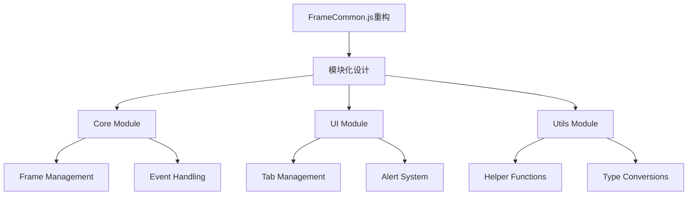
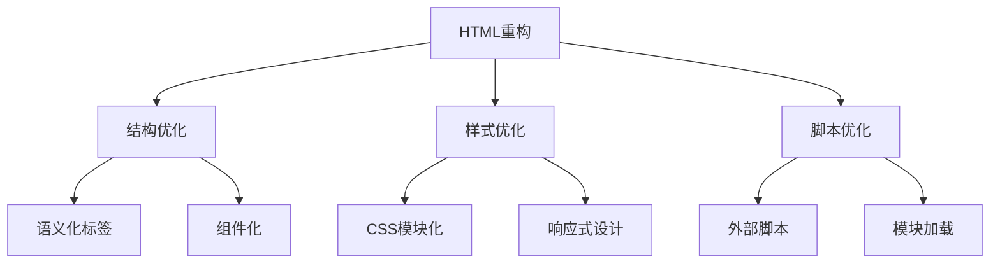
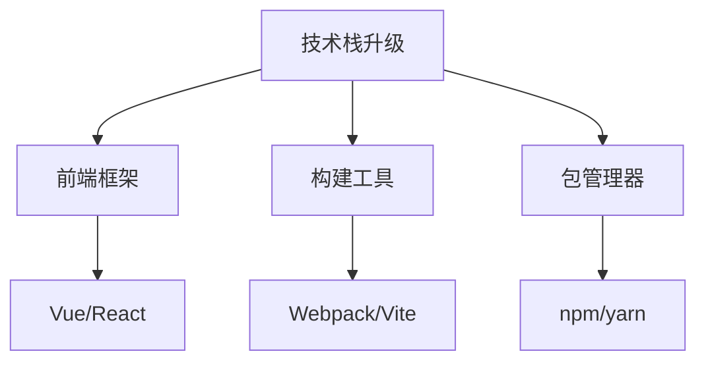
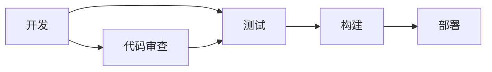

# 项目详细改进建议文档

## 1. JavaScript文件分析

### 1.1 FrameCommon.js

#### 当前问题
1. **全局变量污染**
```javascript
let ControlDown = false;
let XmlParser = new DOMParser();
let PisType = -1;
// ... 更多全局变量
```
- 大量全局变量导致命名空间污染
- 变量作用域不清晰
- 可能造成内存泄漏

2. **函数组织混乱**
```javascript
function SendMessage(obj){...}
function FramePreview(xml){...}
function AddTab(tabView,view, name, selected){...}
```
- 函数之间缺乏组织
- 没有模块化设计
- 功能耦合度高

3. **错误处理不完善**
```javascript
error: function (errorMsg) {
    alert = new ht.ui.Alert({
        // ... 简单的错误提示
    });
}
```
- 错误处理过于简单
- 缺乏错误日志记录
- 没有错误恢复机制

#### 改进建议



**具体改进方案**：

1. **模块化重构**
```javascript
// core/FrameManager.js
export class FrameManager {
    constructor() {
        this.controlDown = false;
        this.xmlParser = new DOMParser();
    }
    
    sendMessage(obj) {
        if (window.sendParentMsg !== undefined) {
            window.sendParentMsg(obj);
        }
    }
}

// ui/TabManager.js
export class TabManager {
    addTab(tabView, view, name, selected) {
        const tab = new ht.Tab();
        tab.setName(name);
        tab.setView(view);
        
        const tabModel = tabView.getTabModel();
        tabModel.add(tab);
        if(selected) {
            tabModel.getSelectionModel().setSelection(tab);
        }
        return tab;
    }
}
```

2. **错误处理优化**
```javascript
// utils/ErrorHandler.js
export class ErrorHandler {
    static handleError(error, context) {
        console.error(`Error in ${context}:`, error);
        
        // 记录错误日志
        this.logError(error);
        
        // 显示用户友好的错误提示
        this.showErrorAlert(error);
        
        // 尝试恢复
        this.attemptRecovery(error);
    }
    
    static logError(error) {
        // 实现错误日志记录
    }
    
    static showErrorAlert(error) {
        // 实现错误提示
    }
    
    static attemptRecovery(error) {
        // 实现错误恢复
    }
}
```

### 1.2 其他JavaScript文件

#### jquery-3.7.1.min.js
- 建议升级到最新版本
- 考虑使用原生JavaScript替代部分jQuery功能

#### jquery-ui.js
- 建议升级到最新版本
- 考虑使用现代UI框架替代

#### select2.min.js
- 建议升级到最新版本
- 考虑使用更现代的组件库

## 2. HTML文件分析

### 2.1 frameEdit.html

#### 当前问题
1. **样式内联**
```html
<style>
    html, body {
        padding: 0px;
        margin: 0px;
    }
    // ... 更多内联样式
</style>
```
- 样式与结构混合
- 难以维护
- 缺乏响应式设计

2. **脚本内联**
```html
<script>
    // ... 大量内联脚本
</script>
```
- JavaScript代码与HTML混合
- 难以维护和测试
- 性能问题

#### 改进建议



**具体改进方案**：

1. **结构优化**
```html
<!DOCTYPE html>
<html lang="en">
<head>
    <meta charset="UTF-8">
    <title>Frame Editor</title>
    <link rel="stylesheet" href="css/main.css">
</head>
<body>
    <div class="app-container">
        <header class="app-header">
            <!-- 头部内容 -->
        </header>
        <main class="app-main">
            <!-- 主要内容 -->
        </main>
        <footer class="app-footer">
            <!-- 底部内容 -->
        </footer>
    </div>
    <script type="module" src="js/main.js"></script>
</body>
</html>
```

2. **样式优化**
```css
/* css/main.css */
:root {
    --primary-color: #007bff;
    --secondary-color: #6c757d;
    /* 更多变量定义 */
}

.app-container {
    display: flex;
    flex-direction: column;
    min-height: 100vh;
}

/* 响应式设计 */
@media (max-width: 768px) {
    .app-container {
        /* 移动端样式 */
    }
}
```

### 2.2 其他HTML文件

#### property.html
- 建议实现组件化
- 添加表单验证
- 优化用户交互

#### frameView.html
- 建议实现响应式设计
- 优化性能
- 添加加载状态

## 3. 整体架构改进

### 3.1 技术栈升级


### 3.2 开发流程优化


## 4. 具体实施计划

### 4.1 第一阶段：基础架构
1. 搭建新的项目结构
2. 引入现代前端框架
3. 配置构建工具

### 4.2 第二阶段：功能迁移
1. 逐步迁移现有功能
2. 实现组件化
3. 优化性能

### 4.3 第三阶段：优化完善
1. 添加测试
2. 优化用户体验
3. 完善文档

## 5. 预期收益

1. **可维护性提升**
   - 代码结构清晰
   - 易于扩展
   - 便于团队协作

2. **性能优化**
   - 加载速度提升
   - 运行效率提高
   - 资源占用降低

3. **用户体验改善**
   - 响应式设计
   - 交互优化
   - 错误处理完善

4. **开发效率提高**
   - 现代化工具链
   - 自动化流程
   - 更好的调试体验 