# HTML 文件分析文档

## 一、frameEdit.html

### 1. 功能概述

`frameEdit.html` 是项目的编辑器主页面，负责提供帧编辑的核心功能，包括元素添加、编辑、删除、属性配置、XML 导入导出等。

### 2. 页面结构

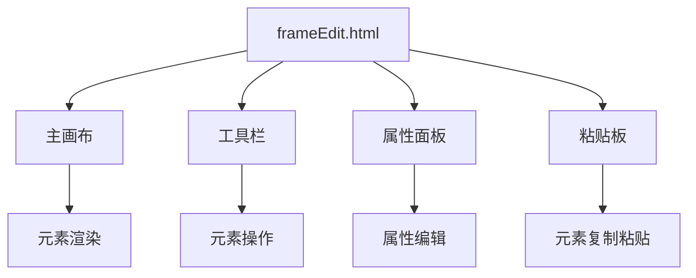

### 3. 主要功能流程

#### 3.1 页面加载流程

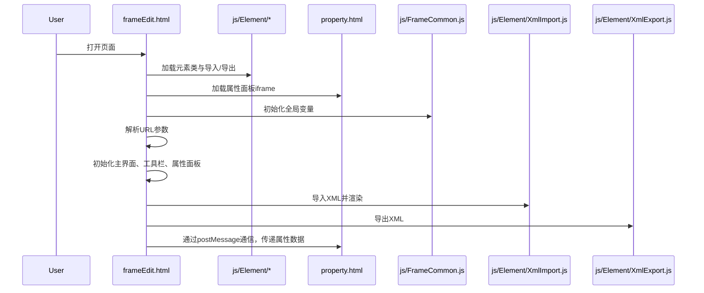

#### 3.2 元素操作流程

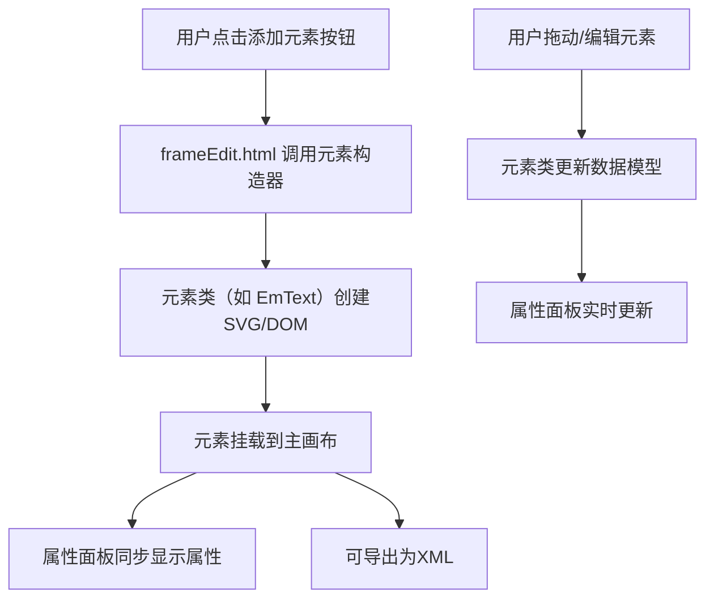

### 4. 关键代码示例

```javascript
// 初始化主界面
function init(width, height) {
    // 创建根div
    let rootDiv = createDiv('rootDiv', '#c1c1c1');
    $(rootDiv).css("width", "100%");
    $(rootDiv).css("height", "88%");

    // 创建背板
    let boardBackDiv = createDiv(backDivId, '#34495E00');
    let $backDiv = $(boardBackDiv);
    $backDiv.css("box-sizing", "border-box");
    $backDiv.css("background-image", "url('./images/back.png')");
    $backDiv.css("background-repeat", "repeat");
    window.backDiv = $backDiv;
    rootDiv.append(boardBackDiv);

    // 创建工具栏
    let topView = createDiv('leftTopArea', '#d4d0cd');
    let $topTitle = $('<div>').addClass("top-title-wrap");
    let $topTitleInner = $('<div>').addClass("top-title-inner").text('功能菜单');
    $topTitle.append($topTitleInner[0]);
    topView.append($topTitle[0]);

    // 创建属性面板
    let propertyPane = new ht.widget.PropertyPane(dataModel);
    let propertyView = propertyPane.getPropertyView();
    let rightPropertyView = propertyView.getView();
    rightPropertyView.className = 'property-wrap';
    window.propertyView = propertyView;

    // 创建主视图
    let mainView = new ht.widget.SplitView(topSplitView, tabRightView, 'h', -320);
    mainView.setDividerBackground('#d4d0cd');
    let view = mainView.getView();
    view.className = 'main';
    document.body.appendChild(view);
}
```

## 二、frameView.html

### 1. 功能概述

`frameView.html` 是项目的只读视图页面，用于展示帧内容，不支持编辑功能。

### 2. 页面结构

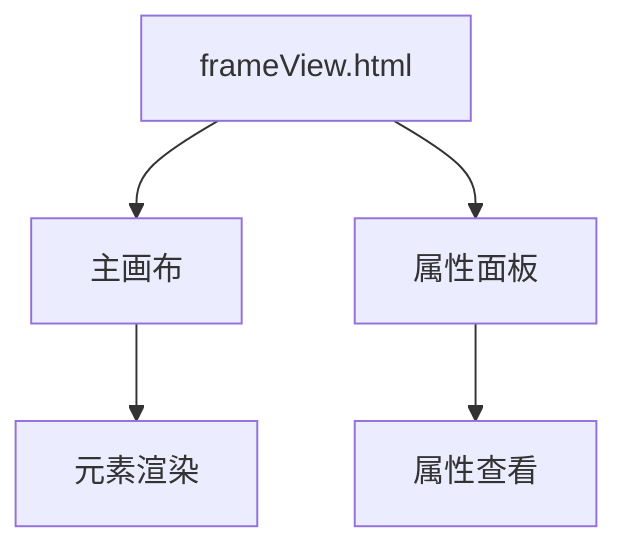

### 3. 主要功能流程

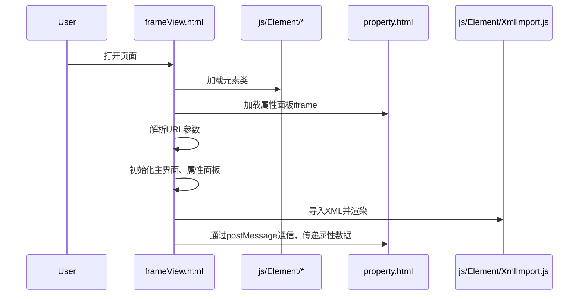

### 4. 关键代码示例

```javascript
// 初始化主界面
function init(width, height) {
    // 创建根div
    let rootDiv = createDiv('rootDiv', '#c1c1c1');
    $(rootDiv).css("width", "100%");
    $(rootDiv).css("height", "88%");

    // 创建背板
    let boardBackDiv = createDiv(backDivId, '#34495E00');
    let $backDiv = $(boardBackDiv);
    $backDiv.css("box-sizing", "border-box");
    $backDiv.css("background-image", "url('./images/back.png')");
    $backDiv.css("background-repeat", "repeat");
    window.backDiv = $backDiv;
    rootDiv.append(boardBackDiv);

    // 创建属性面板
    let propertyPane = new ht.widget.PropertyPane(dataModel);
    let propertyView = propertyPane.getPropertyView();
    let rightPropertyView = propertyView.getView();
    rightPropertyView.className = 'property-wrap';
    window.propertyView = propertyView;

    // 创建主视图
    let mainView = new ht.widget.SplitView(topSplitView, tabRightView, 'h', -320);
    mainView.setDividerBackground('#d4d0cd');
    let view = mainView.getView();
    view.className = 'main';
    document.body.appendChild(view);
}
```

## 三、property.html

### 1. 功能概述

`property.html` 是项目的属性面板页面，用于显示和编辑元素的属性。

### 2. 页面结构

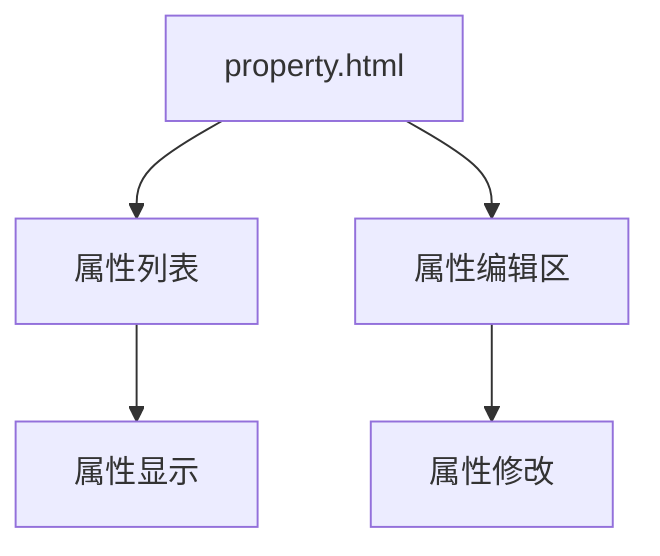

### 3. 主要功能流程

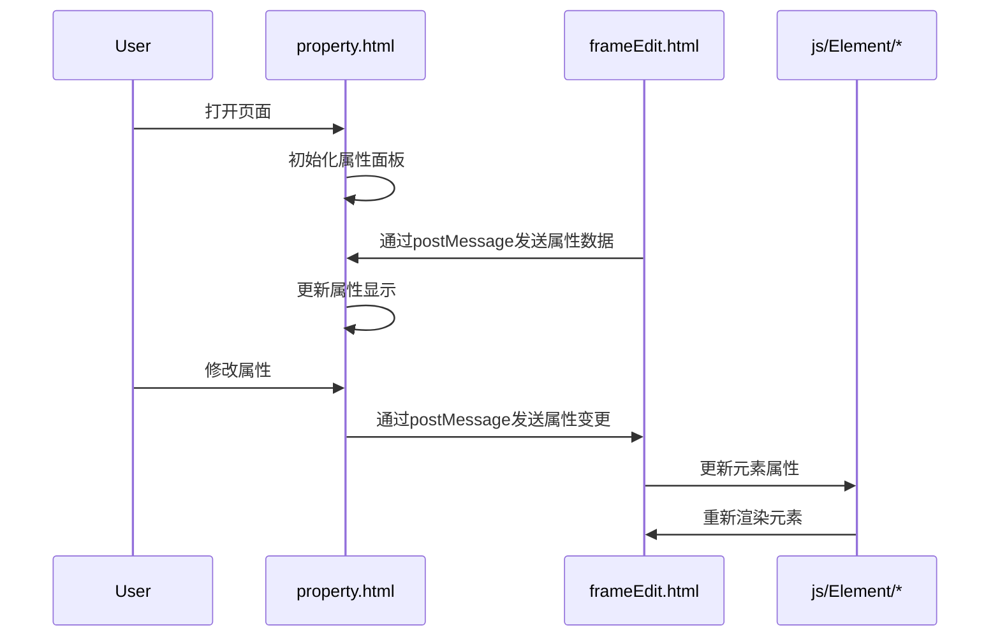

### 4. 关键代码示例

```javascript
// 初始化属性面板
function initPropertyPanel() {
    // 创建属性列表
    let propertyList = document.createElement('div');
    propertyList.className = 'property-list';
    document.body.appendChild(propertyList);

    // 创建属性编辑区
    let propertyEdit = document.createElement('div');
    propertyEdit.className = 'property-edit';
    document.body.appendChild(propertyEdit);

    // 监听postMessage
    window.addEventListener('message', function(event) {
        let data = event.data;
        if (data.type === 'update') {
            updatePropertyDisplay(data.properties);
        }
    });
}

// 更新属性显示
function updatePropertyDisplay(properties) {
    let propertyList = document.querySelector('.property-list');
    propertyList.innerHTML = '';
    for (let key in properties) {
        let propertyItem = document.createElement('div');
        propertyItem.className = 'property-item';
        propertyItem.innerHTML = `<span>${key}:</span><span>${properties[key]}</span>`;
        propertyList.appendChild(propertyItem);
    }
}
```

## 四、filterCondition.html

### 1. 功能概述

`filterCondition.html` 是项目的过滤条件页面，用于设置元素的过滤条件。

### 2. 页面结构

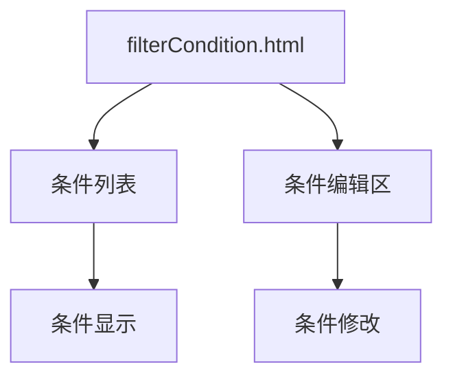

### 3. 主要功能流程

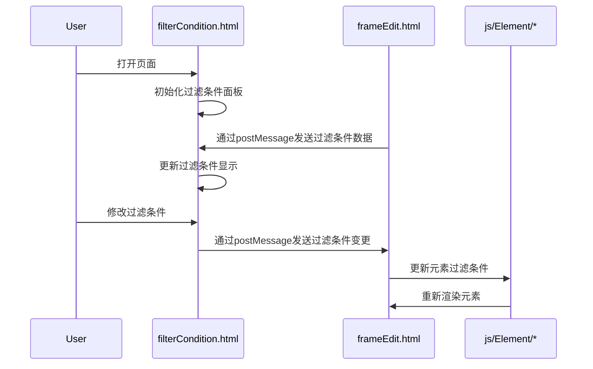

### 4. 关键代码示例

```javascript
// 初始化过滤条件面板
function initFilterConditionPanel() {
    // 创建条件列表
    let conditionList = document.createElement('div');
    conditionList.className = 'condition-list';
    document.body.appendChild(conditionList);

    // 创建条件编辑区
    let conditionEdit = document.createElement('div');
    conditionEdit.className = 'condition-edit';
    document.body.appendChild(conditionEdit);

    // 监听postMessage
    window.addEventListener('message', function(event) {
        let data = event.data;
        if (data.type === 'update') {
            updateConditionDisplay(data.conditions);
        }
    });
}

// 更新条件显示
function updateConditionDisplay(conditions) {
    let conditionList = document.querySelector('.condition-list');
    conditionList.innerHTML = '';
    for (let key in conditions) {
        let conditionItem = document.createElement('div');
        conditionItem.className = 'condition-item';
        conditionItem.innerHTML = `<span>${key}:</span><span>${conditions[key]}</span>`;
        conditionList.appendChild(conditionItem);
    }
}
```

## 五、test.html

### 1. 功能概述

`test.html` 是项目的测试页面，用于测试各种功能和组件。

### 2. 页面结构

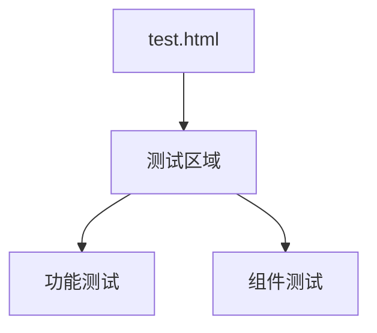

### 3. 主要功能流程

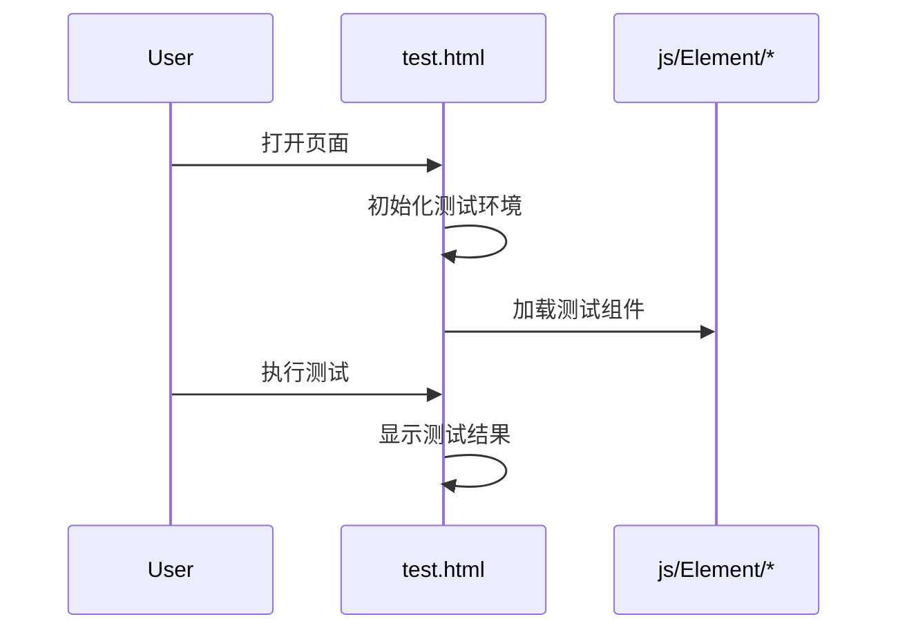

### 4. 关键代码示例

```javascript
// 初始化测试环境
function initTestEnvironment() {
    // 创建测试区域
    let testArea = document.createElement('div');
    testArea.className = 'test-area';
    document.body.appendChild(testArea);

    // 加载测试组件
    loadTestComponents();
}

// 加载测试组件
function loadTestComponents() {
    // 加载元素类
    import('./js/Element/EmText.js').then(module => {
        let EmText = module.EmText;
        // 测试 EmText
        testEmText(EmText);
    });

    // 加载其他组件
    // ...
}

// 测试 EmText
function testEmText(EmText) {
    let emText = new EmText();
    // 执行测试
    // ...
    // 显示测试结果
    displayTestResult(result);
}
```

## 六、总结

通过对项目中 HTML 文件的分析，我们可以看到：

1. `frameEdit.html` 是核心编辑器页面，提供帧编辑的主要功能。
2. `frameView.html` 是只读视图页面，用于展示帧内容。
3. `property.html` 是属性面板页面，用于显示和编辑元素属性。
4. `filterCondition.html` 是过滤条件页面，用于设置元素的过滤条件。
5. `test.html` 是测试页面，用于测试各种功能和组件。

每个页面都有其特定的功能和用途，通过流程图、时序图和代码示例，我们可以更好地理解它们的工作原理和交互方式。

---

如需更详细的某一部分（如某个页面的详细代码解读、具体功能说明等），可进一步指定。 