# JavaScript 文件分析文档

## 一、核心框架文件

### 1. FrameCommon.js

#### 1.1 功能概述

`FrameCommon.js` 是项目的核心框架文件，提供了基础功能支持，包括：
- 全局变量和常量定义
- 工具函数集合
- 事件处理系统
- 数据模型管理
- 界面初始化和管理

#### 1.2 引入位置
- `frameEdit.html`：第 214 行
- `frameView.html`：第 181 行

#### 1.3 核心功能结构

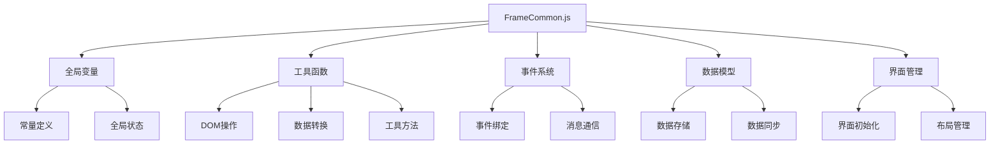

#### 1.4 主要功能流程

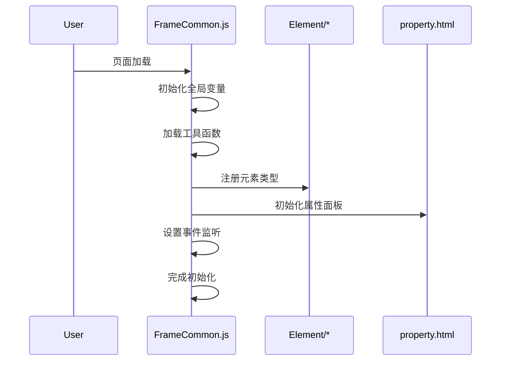

#### 1.5 关键代码示例

```javascript
// 全局变量定义
var dataModel = new ht.DataModel();
var graphView = new ht.graph.GraphView(dataModel);
var propertyPane = new ht.widget.PropertyPane(dataModel);

// 工具函数
function createDiv(id, color) {
    let div = document.createElement('div');
    div.id = id;
    div.style.backgroundColor = color;
    return div;
}

// 事件处理
function initEventListeners() {
    graphView.addPropertyChangeListener(function(e) {
        if(e.property === 'select') {
            updatePropertyPanel(e.newValue);
        }
    });
}
```

### 2. Common.js

#### 2.1 功能概述

`Common.js` 是元素模块的公共基础文件，提供了：
- 元素基类定义
- 公共属性和方法
- 元素生命周期管理
- 事件处理机制

#### 2.2 引入位置
- 通过 `FrameCommon.js` 动态加载
- 作为元素类的基础依赖

#### 2.3 核心功能结构

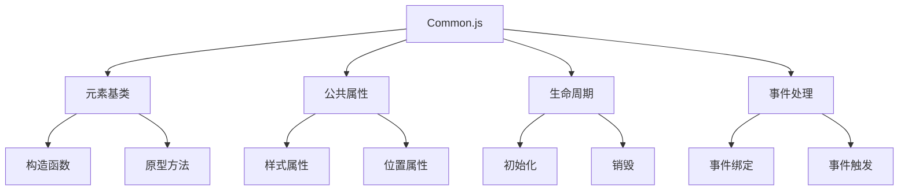

#### 2.4 主要功能流程

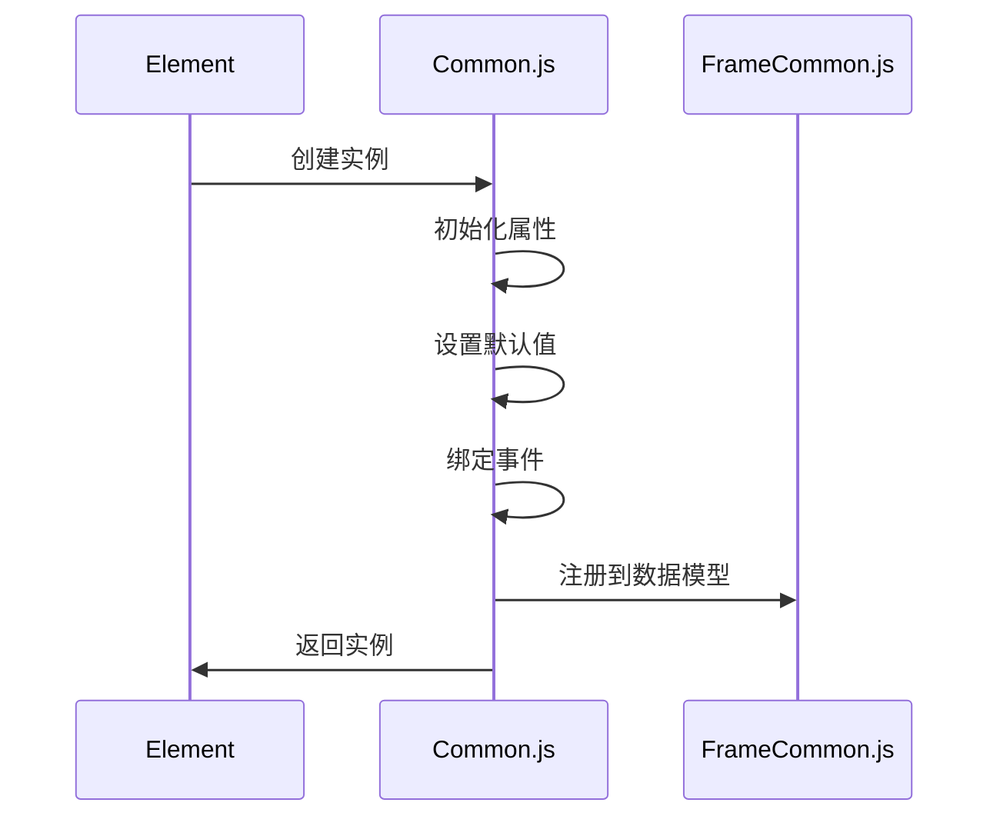

#### 2.5 关键代码示例

```javascript
// 元素基类定义
function BaseElement() {
    this.id = generateId();
    this.properties = {};
    this.events = {};
}

// 公共方法
BaseElement.prototype = {
    init: function() {
        // 初始化逻辑
    },
    
    destroy: function() {
        // 销毁逻辑
    },
    
    update: function(properties) {
        // 更新属性
    }
};
```

## 二、元素类文件

### 1. EmText.js

#### 1.1 功能概述

`EmText.js` 实现了文本元素的功能，包括：
- 文本内容编辑
- 样式设置
- 位置调整
- 事件处理

#### 1.2 引入位置
- 通过 `FrameCommon.js` 动态加载
- 在需要创建文本元素时被加载

#### 1.3 核心功能结构

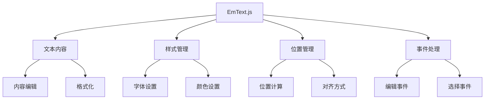

#### 1.4 主要功能流程

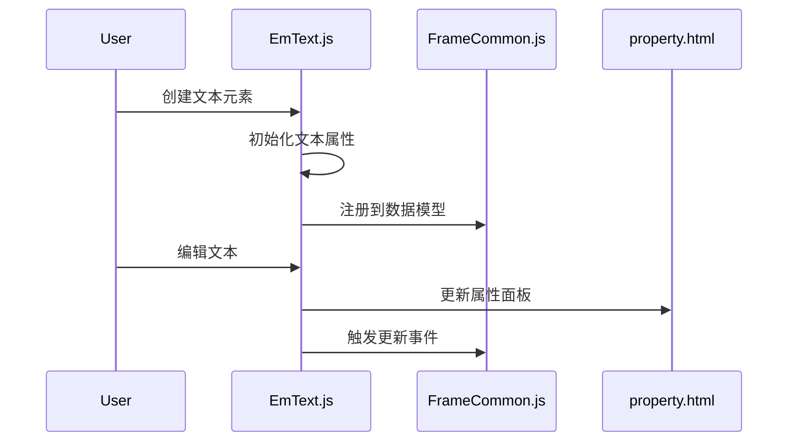

#### 1.5 关键代码示例

```javascript
// 文本元素类
function EmText() {
    BaseElement.call(this);
    this.type = 'text';
    this.content = '';
    this.style = {
        fontSize: 14,
        fontFamily: 'Arial',
        color: '#000000'
    };
}

// 继承基类
EmText.prototype = Object.create(BaseElement.prototype);

// 文本编辑方法
EmText.prototype.edit = function(content) {
    this.content = content;
    this.update();
};
```

### 2. EmImage.js

#### 2.1 功能概述

`EmImage.js` 实现了图片元素的功能，包括：
- 图片加载和显示
- 尺寸调整
- 位置控制
- 样式设置

#### 2.2 引入位置
- 通过 `FrameCommon.js` 动态加载
- 在需要创建图片元素时被加载

#### 2.3 核心功能结构

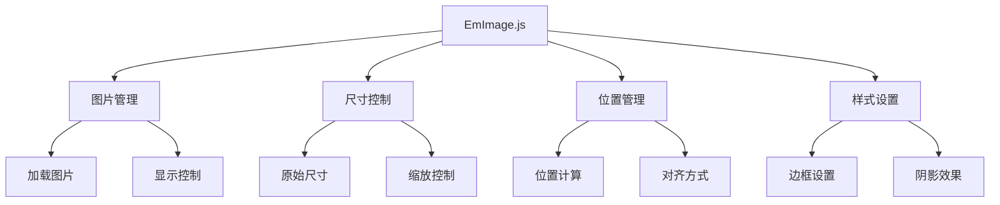

#### 2.4 主要功能流程

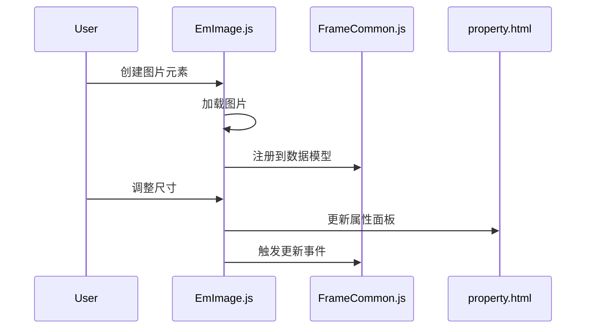

#### 2.5 关键代码示例

```javascript
// 图片元素类
function EmImage() {
    BaseElement.call(this);
    this.type = 'image';
    this.src = '';
    this.size = {
        width: 100,
        height: 100
    };
}

// 继承基类
EmImage.prototype = Object.create(BaseElement.prototype);

// 加载图片方法
EmImage.prototype.load = function(src) {
    this.src = src;
    this.update();
};
```

## 三、工具类文件

### 1. XmlImport.js

#### 1.1 功能概述

`XmlImport.js` 负责 XML 数据的导入功能，包括：
- XML 解析
- 数据转换
- 元素创建
- 属性设置

#### 1.2 引入位置
- 通过 `FrameCommon.js` 动态加载
- 在需要导入 XML 数据时被加载

#### 1.3 核心功能结构

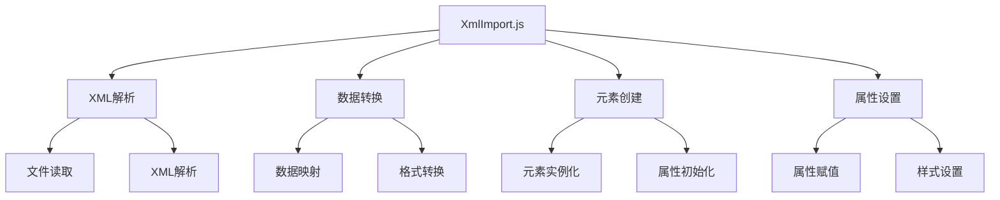

#### 1.4 主要功能流程

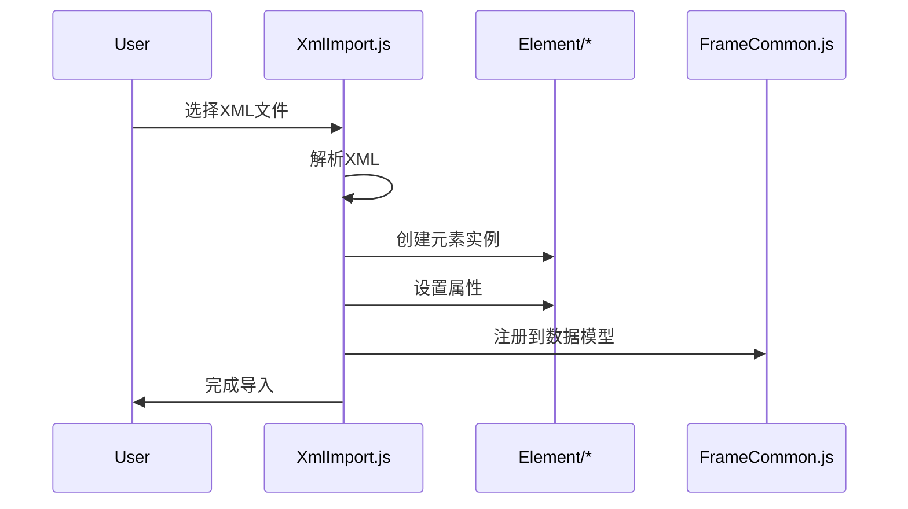

#### 1.5 关键代码示例

```javascript
// XML导入类
function XmlImporter() {
    this.parser = new DOMParser();
}

// 导入方法
XmlImporter.prototype.import = function(xmlString) {
    let doc = this.parser.parseFromString(xmlString, 'text/xml');
    let elements = doc.getElementsByTagName('element');
    
    for(let element of elements) {
        let type = element.getAttribute('type');
        let properties = this.parseProperties(element);
        this.createElement(type, properties);
    }
};
```

### 2. XmlExport.js

#### 2.1 功能概述

`XmlExport.js` 负责将元素数据导出为 XML 格式，包括：
- 数据收集
- XML 生成
- 文件保存

#### 2.2 引入位置
- 通过 `FrameCommon.js` 动态加载
- 在需要导出 XML 数据时被加载

#### 2.3 核心功能结构

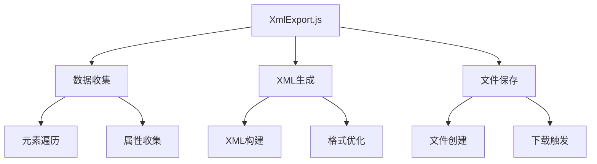

#### 2.4 主要功能流程

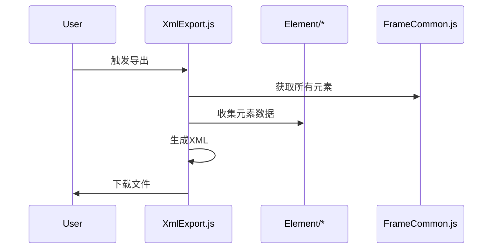

#### 2.5 关键代码示例

```javascript
// XML导出类
function XmlExporter() {
    this.serializer = new XMLSerializer();
}

// 导出方法
XmlExporter.prototype.export = function(elements) {
    let doc = document.implementation.createDocument('', '', null);
    let root = doc.createElement('elements');
    
    for(let element of elements) {
        let elementNode = this.createElementNode(element);
        root.appendChild(elementNode);
    }
    
    return this.serializer.serializeToString(root);
};
```

## 四、其他工具文件

### 1. Clipboard.js

#### 1.1 功能概述

`Clipboard.js` 实现了剪贴板功能，包括：
- 元素复制
- 元素粘贴
- 数据序列化
- 数据反序列化

#### 1.2 引入位置
- 通过 `FrameCommon.js` 动态加载
- 在需要复制/粘贴功能时被加载

#### 1.3 核心功能结构

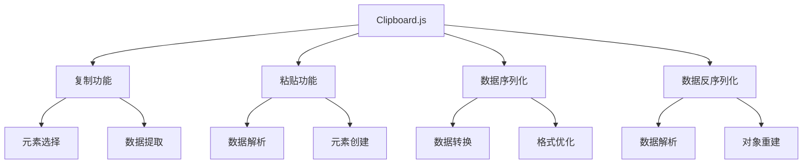

#### 1.4 主要功能流程

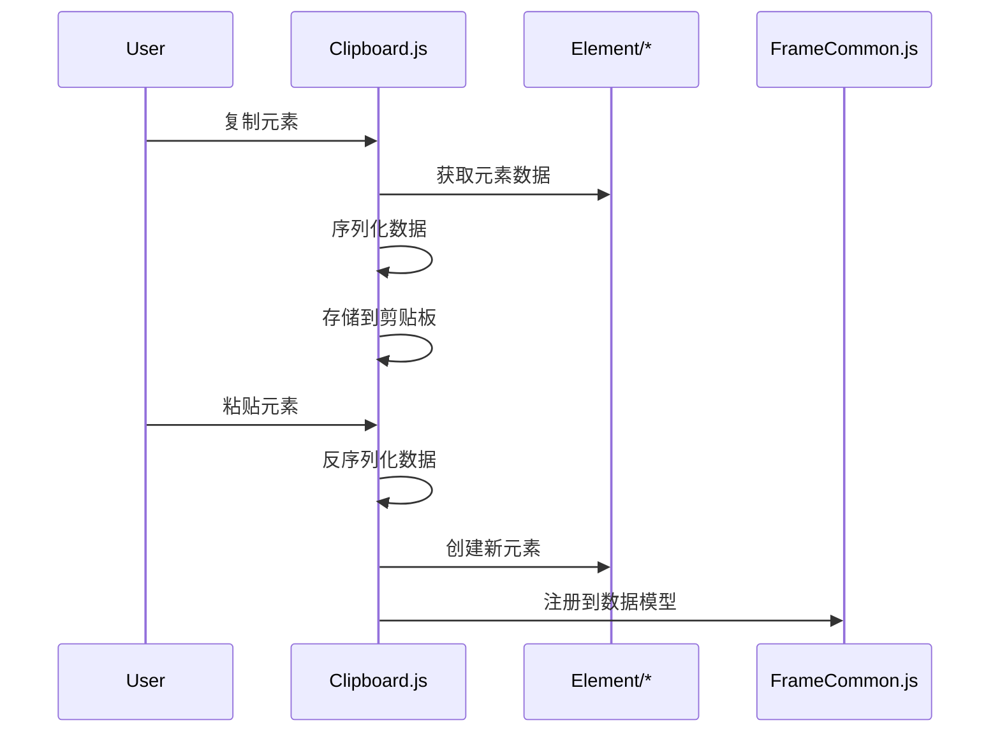

#### 1.5 关键代码示例

```javascript
// 剪贴板类
function Clipboard() {
    this.data = null;
}

// 复制方法
Clipboard.prototype.copy = function(elements) {
    this.data = elements.map(element => {
        return {
            type: element.type,
            properties: element.getProperties()
        };
    });
};

// 粘贴方法
Clipboard.prototype.paste = function() {
    if(!this.data) return;
    
    return this.data.map(item => {
        let element = new window[item.type]();
        element.setProperties(item.properties);
        return element;
    });
};
```

## 五、第三方库文件

### 1. jQuery 相关
- `jquery-3.7.1.min.js`：所有页面都引入
- `jquery-ui.js`：所有页面都引入
- `jquery.thooClock.js`：在 `frameEdit.html` 和 `frameView.html` 中引入

### 2. HT 相关
- `ht/core/ht.js`：在 `frameEdit.html` 和 `frameView.html` 中引入
- `ht/plugin/ht-form.js`：在 `frameEdit.html` 和 `frameView.html` 中引入
- `ht/plugin/ht-propertypane.js`：在 `frameEdit.html` 中引入
- `ht/plugin/ht-cssanimation.js`：在 `frameEdit.html` 和 `frameView.html` 中引入
- `ht/plugin/ht-autolayout.js`：在 `frameEdit.html` 和 `frameView.html` 中引入
- `ht/plugin/ht-dialog.js`：在 `frameEdit.html` 和 `frameView.html` 中引入

### 3. 其他工具
- `select2.min.js`：在 `test.html`、`property.html` 和 `filterCondition.html` 中引入
- `debugTemp.js`：在 `frameEdit.html` 中引入
- `ContextMenu/contextMenu.js`：在 `frameEdit.html` 和 `frameView.html` 中引入

## 六、总结

通过对项目中 JavaScript 文件的分析，我们可以看到：

1. 核心框架文件：
   - `FrameCommon.js`：提供基础框架支持，在 `frameEdit.html` 和 `frameView.html` 中引入
   - `Common.js`：提供元素基类功能，通过 `FrameCommon.js` 动态加载

2. 元素类文件：
   - `EmText.js`：文本元素实现，通过 `FrameCommon.js` 动态加载
   - `EmImage.js`：图片元素实现，通过 `FrameCommon.js` 动态加载
   - 其他元素类文件实现各自特定的元素类型，通过 `FrameCommon.js` 动态加载

3. 工具类文件：
   - `XmlImport.js`：XML 导入功能，通过 `FrameCommon.js` 动态加载
   - `XmlExport.js`：XML 导出功能，通过 `FrameCommon.js` 动态加载
   - `Clipboard.js`：剪贴板功能，通过 `FrameCommon.js` 动态加载

4. 第三方库：
   - jQuery 相关库在所有页面中都有使用
   - HT 相关库主要在 `frameEdit.html` 和 `frameView.html` 中使用
   - 其他工具库根据功能需求在不同页面中引入

每个文件都有其特定的功能和用途，通过流程图、时序图和代码示例，我们可以更好地理解它们的工作原理和交互方式。同时，了解文件的引入位置有助于理解代码的加载时机和依赖关系。

## 七、HTML 文件中的 JavaScript 代码分析

### 1. frameEdit.html

#### 1.1 功能概述

`frameEdit.html` 是框架编辑器的核心页面，其 JavaScript 代码主要负责：
- 页面布局和样式管理
- 元素编辑功能
- 工具栏操作
- 事件处理系统
- 数据模型管理

#### 1.2 核心功能结构

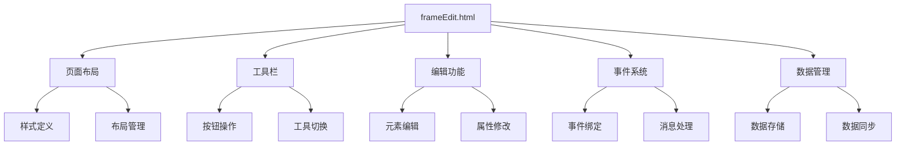

#### 1.3 主要功能流程

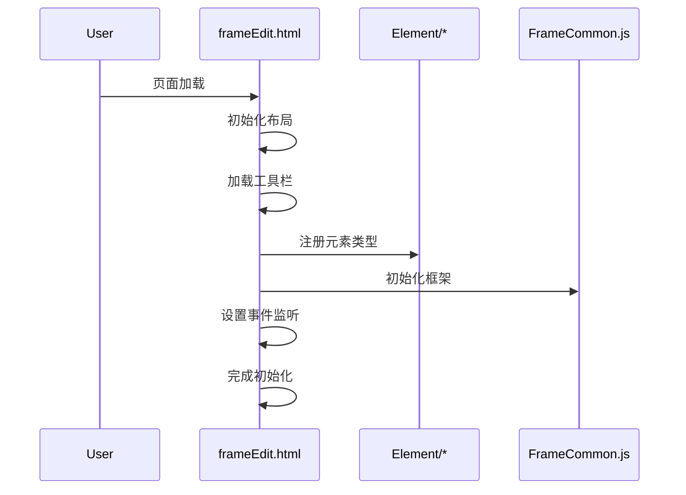

### 2. frameView.html

#### 2.1 功能概述

`frameView.html` 是框架查看器页面，其 JavaScript 代码主要负责：
- 页面展示
- 元素渲染
- 交互控制
- 数据同步

#### 2.2 核心功能结构

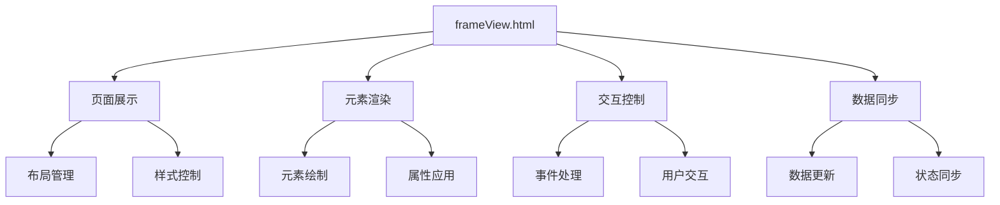

#### 2.3 主要功能流程

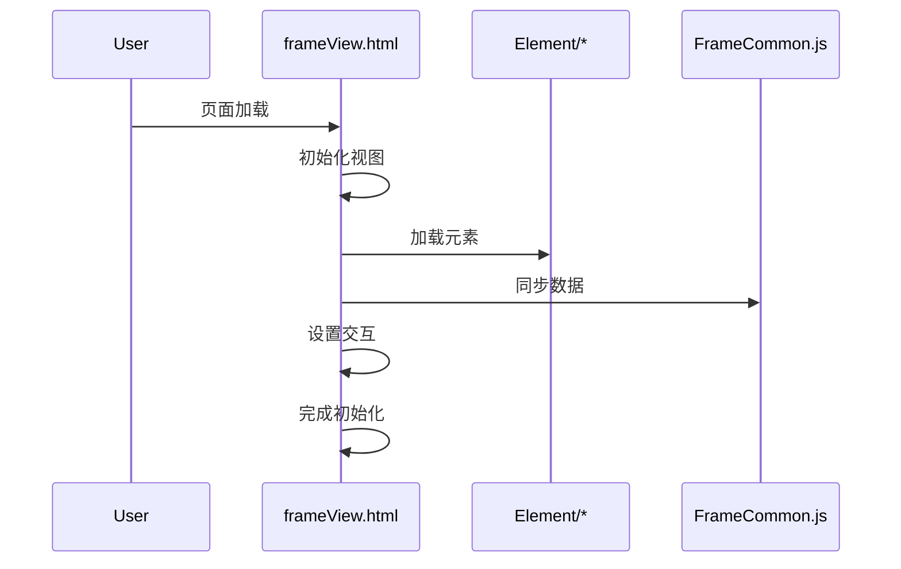

### 3. property.html

#### 3.1 功能概述

`property.html` 是属性编辑页面，其 JavaScript 代码主要负责：
- 属性表格管理
- 属性值编辑
- 数据绑定
- 事件处理

#### 3.2 核心功能结构

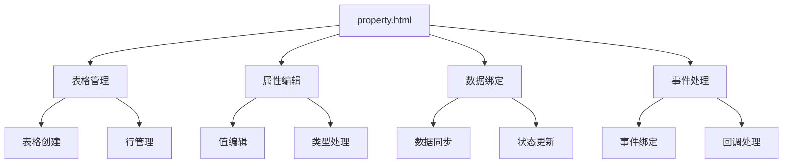

#### 3.3 主要功能流程

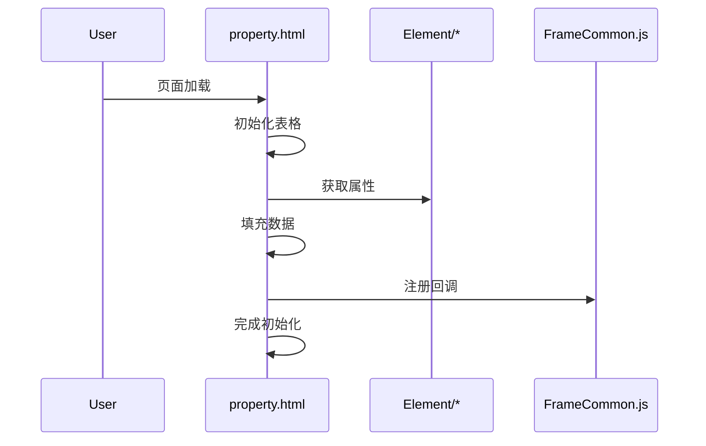

### 4. filterCondition.html

#### 4.1 功能概述

`filterCondition.html` 是条件过滤页面，其 JavaScript 代码主要负责：
- 条件编辑
- 字段选择
- 日期处理
- 数据过滤

#### 4.2 核心功能结构

```mermaid
graph TD
    A[filterCondition.html] --> B[条件编辑]
    A --> C[字段管理]
    A --> D[日期处理]
    A --> E[数据过滤]
    
    B --> B1[条件构建]
    B --> B2[操作符处理]
    
    C --> C1[字段选择]
    C --> C2[数据源管理]
    
    D --> D1[日期选择]
    D --> D2[格式处理]
    
    E --> E1[数据筛选]
    E --> E2[结果处理]
```

#### 4.3 主要功能流程

```mermaid
sequenceDiagram
    participant User
    participant filterCondition.html
    participant DataSource
    participant ParentDialog

    User->>filterCondition.html: 页面加载
    filterCondition.html->>DataSource: 获取数据源
    filterCondition.html->>filterCondition.html: 初始化界面
    User->>filterCondition.html: 编辑条件
    filterCondition.html->>ParentDialog: 提交结果
    filterCondition.html->>filterCondition.html: 完成操作
```

### 5. 关键代码示例

#### 5.1 frameEdit.html 中的关键代码

```javascript
// 页面初始化
$(function() {
    // 初始化布局
    initLayout();
    // 加载工具栏
    initToolbar();
    // 注册元素类型
    registerElements();
    // 设置事件监听
    setupEventListeners();
});

// 工具栏操作
function handleToolbarAction(action) {
    switch(action) {
        case 'add':
            addElement();
            break;
        case 'delete':
            deleteElement();
            break;
        // ... 其他操作
    }
}
```

#### 5.2 property.html 中的关键代码

```javascript
// 属性表格初始化
function Init() {
    let headers = ["项", "值"];
    $table = $('<table>').attr('id', 'propertyTable');
    $tbody = $('<tbody>').attr('id', 'propertyBody');
    
    // 创建表头
    let $tr = $('<tr>');
    $.each(headers, function(index, value) {
        $tr.append($('<th>').text(value));
    });
    
    // 绑定事件
    $table.click(function(e) {
        handleTableClick(e);
    });
}

// 添加属性
function AddPropertyUseId(id, name, data, ds, type, setValue) {
    // 创建属性行
    let $tr = $('<tr>');
    let $nameTd = $('<td>').attr('id', 'nameTd_' + id);
    let $valueTd = $('<td>').attr('id', 'valueTd_' + id);
    
    // 设置属性值
    $nameTd.text(name);
    $valueTd.append(createValueElement(type, data, ds, setValue));
    
    $tr.append($nameTd).append($valueTd);
    $tbody.append($tr);
}
```

#### 5.3 filterCondition.html 中的关键代码

```javascript
// 条件编辑处理
function btnBiggerClick() {
    let $txtCondition = $("#txtCondition");
    let cdStr = $txtCondition.val();
    cdStr = cdStr + " 大于";
    $txtCondition.val(cdStr);
}

// 字段列表处理
function filterFieldList(txt, fieldList) {
    let $cbxFieldList = $("#cbxFieldList");
    let drData = [];
    
    if (txt !== null && txt !== "") {
        for (let key in fieldList) {
            if (fieldList[key].startsWith(txt) > 0) {
                drData.push({
                    id: key,
                    text: fieldList[key],
                    selected: false
                });
            }
        }
    }
    
    $cbxFieldList.select2({
        width: '100%',
        data: drData
    });
}
```

## 八、总结

通过对 HTML 文件中 JavaScript 代码的分析，我们可以看到：

1. 页面功能划分清晰：
   - `frameEdit.html`：负责框架编辑
   - `frameView.html`：负责框架查看
   - `property.html`：负责属性编辑
   - `filterCondition.html`：负责条件过滤

2. 代码组织特点：
   - 每个页面都有明确的职责
   - 使用模块化的方式组织代码
   - 通过事件系统实现页面间通信
   - 采用统一的数据管理方式

3. 交互设计：
   - 提供直观的用户界面
   - 实现丰富的交互功能
   - 支持多种操作方式
   - 提供即时的反馈

4. 数据管理：
   - 统一的数据模型
   - 实时的数据同步
   - 灵活的数据绑定
   - 可靠的状态管理

这些 HTML 文件中的 JavaScript 代码共同构成了一个完整的框架编辑系统，通过良好的代码组织和功能划分，实现了复杂的功能需求。通过流程图、时序图和代码示例，我们可以更好地理解它们的工作原理和交互方式。

---

如需更详细的某一部分（如某个文件的详细代码解读、具体功能说明等），可进一步指定。 