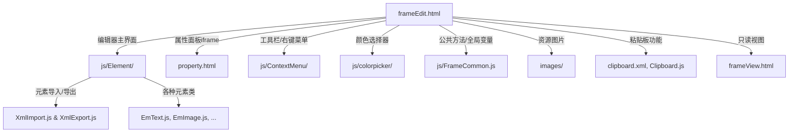
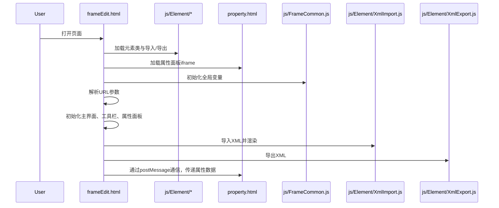
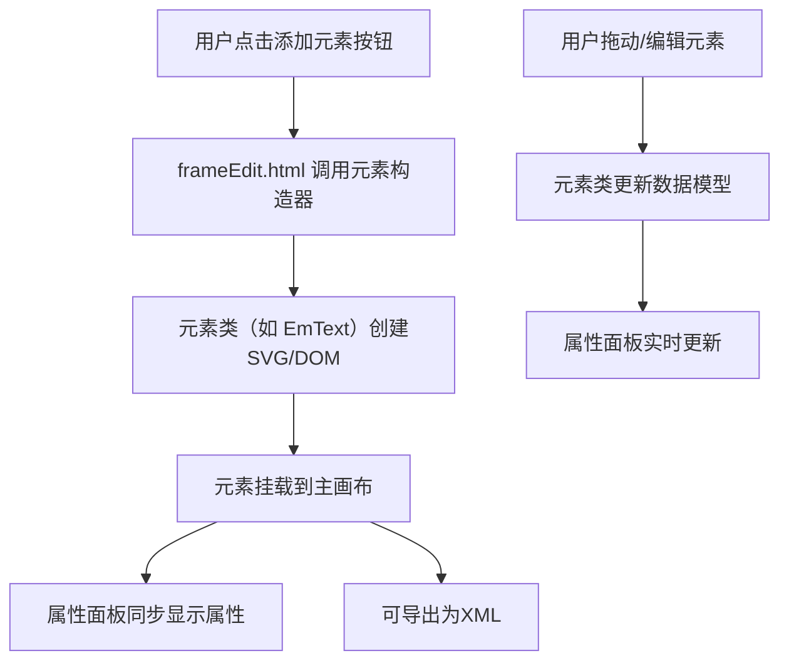
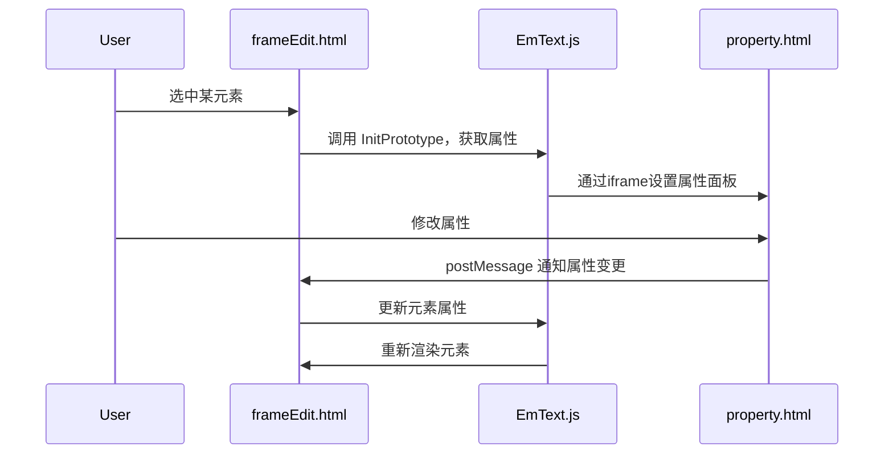

# 项目结构与详细分析文档

## 一、项目结构总览

```
.
├── js/
│   ├── Element/         # 各种自定义元素（如文本、表格、图形等）及其导入导出
│   ├── ContextMenu/     # 右键菜单相关
│   ├── colorpicker/     # 颜色选择器相关
│   ├── ht/              # 可能为第三方/自定义图形库
│   ├── images/          # JS相关图片资源
│   ├── FrameCommon.js   # 公共方法与全局变量
│   └── ...              # 其他依赖库
├── images/              # 全局图片资源
│   └── toolbar/         # 工具栏相关图片
├── frameEdit.html       # 编辑器主页面
├── frameView.html       # 只读视图页面
├── property.html        # 属性面板页面
├── filterCondition.html # 过滤条件页面
├── test.html            # 测试页面
└── clipboard.xml        # 粘贴板相关XML
```

---

## 二、核心页面与模块关系结构图



---

## 三、主流程（以 frameEdit.html 为例）

### 1. 页面加载流程



### 2. 元素操作流程（以添加/编辑元素为例）



---

## 四、主要模块说明

### 1. js/Element/ 目录

- **XmlImport.js / XmlExport.js**：负责元素的 XML 导入与导出，支持批量、结构化数据处理。
- **EmText.js / EmImage.js / EmLine.js ...**：每个文件对应一种可视化元素，负责其渲染、交互、属性绑定。
- **Clipboard.js**：粘贴板功能，支持元素的复制粘贴。
- **StTable.js / DtTable.js**：静态/动态表格元素，支持复杂表格渲染与数据绑定。

### 2. js/FrameCommon.js

- 定义全局变量（如画布尺寸、帧ID、类型等）。
- 提供对齐、分布、居中等常用操作函数。
- 解析屏幕类型字符串，辅助界面自适应。

### 3. js/ContextMenu/

- 自定义右键菜单，支持元素级别的快捷操作。

### 4. js/colorpicker/

- 颜色选择器，支持元素颜色属性的可视化选择。

### 5. frameEdit.html

- 编辑器主页面，集成主画布、工具栏、属性面板、粘贴板等。
- 通过 iframe 嵌入属性面板，采用 postMessage 通信。
- 支持 XML 导入导出、元素拖拽、属性编辑、对齐分布等功能。

### 6. frameView.html

- 只读视图页面，主要用于展示帧内容，不支持编辑。

---

## 五、典型时序图：元素属性编辑



---

## 六、数据流与通信

- **主页面与属性面板**：通过 iframe + postMessage 实现解耦通信。
- **元素与数据模型**：所有元素操作均同步到 `window.dataModel`，便于统一导出/保存。
- **粘贴板与主页面**：通过全局变量和事件驱动实现元素的复制粘贴。

---

## 七、总结

本项目为一个可视化帧编辑器，支持多种元素的可视化编辑、属性配置、XML导入导出、粘贴板、对齐分布等功能。结构清晰，采用模块化设计，便于扩展和维护。前端交互丰富，适合复杂场景下的帧内容编辑与展示。

---

如需更详细的某一部分（如某个元素的实现、某个流程的详细代码解读等），可进一步指定。 